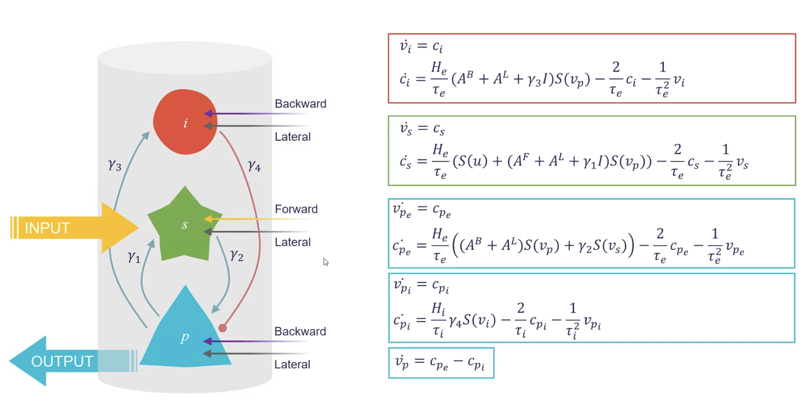

# DCM_SBI_effective_connectivity

## Dynamic cortical modelling (DCM) :

Trying to understand and describe the brain functionning isn't a piece of cake. The first difficulty is the prism through which to study this organ. Within the past century many new exploratory technics emerged, allowing an unprecedented comprehension of the brain.

Those brand new methods such as fMRI( functional Magnetic Resonance Imaging) or EEG (Electroencephalography) allow us to directly study brain connectivity. Wether it is structural connectivity or functionnal and have a directe overview of the whole brain acivity. The idea rapidly emerged to study were those activities come from and how to reproduce them.

To be able to do such an exploit, researches Jansen & jit set aside neuron model for a higher scale with a model of a neuronal population of a cortical region. In this model, we consider modeling brain regions by a common feature: the presence of excitatory pyramidal neurons, excitatory stellate neurons and inhibitory GABAergic interneurons.  These three subpopulations of neurons are sufficient to model a cortical column. The aim of this repository is to present you a this DCM model and the code created during my first intership at the [INT in the BrainNets team](https://www.int.univ-amu.fr/recherche/equipes/brainets) under the supervision PhD Gilson Mathieu. 

For this projet the aim was first to adapt the DCM model of a single cortical column to a general model of as many cortical region interconnected. The next step was to try to estimate the effective connectivity used to create the model with the main features of the pyramidal outputs. To perform this type of estimation we used Bayesian Inference with the SBI python library 

